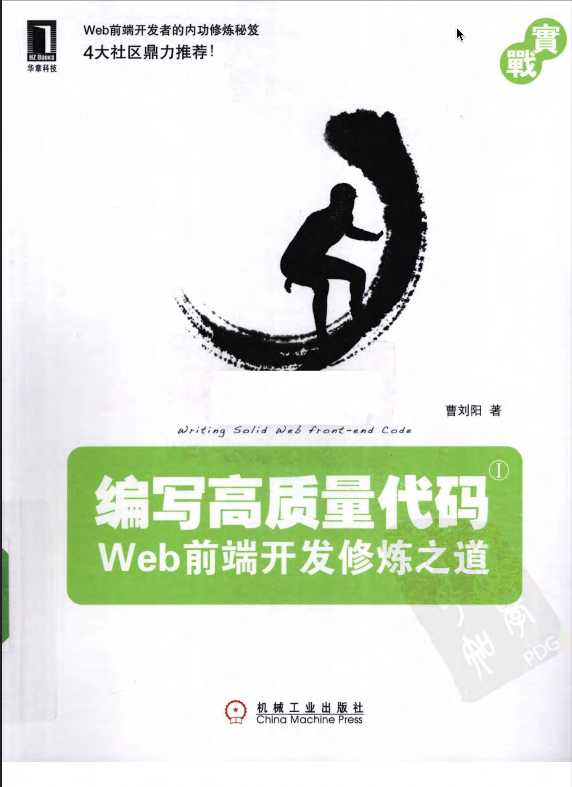

# 编写高质量的代码

## Web前端开发修炼之道

> 本书以网站重构为楔子，深刻而直接地指出了Web前端开发中存在的重要问题——代码难以维护。如何才能提高代码的可维护性？人是最关键的因素！于是本书紧接着全方位的解析了作为一名合格的前端开发工程师应该掌握的技能和承担的职责，这对刚加入前端开发这一行的读者来说有很大的指导意义。同时，还解读了制定规范和团队合作的重要性。

### 前言

以前，会PhotoShop和Dreamweaver就可以制作网页，现在只掌握这些已经远不够了。无论是在开发难度上，还是开发方式上，现在的网页制作都更接近传统的网站后台开发，所以现在不在叫作网页制作，而是叫Web前端开发。Web前端开发是一项很特殊的工作，涵盖的知识面非常广，既有具体的技术，又有抽象的理念。简单的说，它的主要职能就是把网站的洁面更好地呈现给用户。

如何才能做得更好呢？

1. 第一，必须掌握基本的Web前端开发技术，其中包括：CSS、HTML、Ajax、JavaScript等，在掌握这些技术的同时，还要清楚地了解它们在不同浏览器上的兼容情况、渲染原理和存在的Bug。
2. 第二，在一名合格的前端工程师的知识结构中，网站性能优化、SEO和服务器端的基础知识也是必须掌握的。
3. 第三，必须学会运用各种工具进行辅助开发。
4. 第四，除了要掌握技术层面的知识，还要掌握理论层面的知识，包括代码的可维护性、组件的易用性、分层语义模版和浏览器分级支持，等等。

代码质量是前端开发中应该重点考虑的问题之一。例如，实现一个网站界面可能会有无数种方案，但是有些方案的维护成本会比较高，有些方案会存在性能问题，而有些方案则更易于维护，而且性能也比较好。这里的关键影响因素就是代码质量。HTML、CSS、JavaScript这三种前端开发语言的特点是不同的，对代码质量的要求也不同，但它们之间又有着千丝万缕的联系。

### 网站重构

#### Web标准

W3C是一个专门负责制定网页标准的非营利性组织，致力于结束网页制作领域混乱不堪的局面，Web标准就是由W3C组织推行的。要了解最权威、最详细的关于Web标准的信息，可以访问其官方网站：<http://www.w3c.org >。

为什么网页的维护工作会变得越来越难？原因主要来自于三个层面：

+ **浏览器层面。** 浏览器的向前兼容使得前端开发中被淘汰的技术、不推荐的方法依然广为流传和应用，而新一轮的浏览器大战却愈演愈烈，除了Firefox、Opera、Safari、Chrome这些IE的挑战者之外，IE本身也同时流行着数个不同的版本。不容浏览器对网页代码的解析存在着或大或小的差异。
+ **技术层面。** Web标准被重视和普遍采用的时间不长，整个大环境对Web标准的理解还停留在概念层面，对“好的实现方案”仍处于摸索阶段。不同的公司，不同的团队，不同的工程师，对“好的实现方案”有自己的理解，或深或浅。理解不深，就很容易写出可维护性差的代码。
+ **团队合作层面。** 随着用户对使用体验的要求的不断增加，对网页的表现力的要求也越来越高，从而导致实现代码越来越复杂，这无疑给团队合作带来了麻烦。页面越复杂，对团队合作的要求就越高。如果合作不默契，很可能需要不停的打补丁，最后让代码变得千疮百孔，满地是“雷”，没有人愿意去维护它们。

相比于服务器端开发曲折陡峭的学习曲线，前端开发的学习曲线平滑很多。正因为前端开发上手快、门槛低，所以非常多的人通过自学成才，从这一方向进入IT领域。也正因为如此，这一领域的大多数技术人员并没有比较系统的知识结构和良好的编码习惯。虽然有Web标准的概念，但往往并没有一个很好的时间方案。“实践”性的技巧往往比Web标准本身更重要。如果重理论，而忽视了实践，那么代码的质量依然很难得到提高。

#### 打造高品质的前端代码，提高代码的可维护性——精简、重用、有序

***所谓高质量的代码，在Web标准的思想指导下，在实现结构、样式和行为分离的基础上，还要做到三点：精简、重用、有序。*** 精简的代码可以让文件变小，有利于客户端快速下载；重用可以让代码更易于精简，同时有助于提高开发速度；有序可以让我们更清晰地组织代码，是代码易于维护，有效应对变化。

### 团队合作

#### 提高重用性——公共组件和私有组件的维护

团队合作很容易产生的问题之一就是冗余。如果没有事先做好规划，很容易出现在开发过程中针对相同的功能不同的分别编写了相同效果的代码，如果系统升级，这个效果需要改变，那么需要分别去改动对应的代码，这样明显是一种浪费。

避免出现这种冗余的最好办法就是根据代码的重用性，把它们分成公共组件和私有组件两类。设计公共组件时需要考虑让接口保持弹性，并且高度模块化，这是很考验能力和经验的工作。

因为公共组件在设计之初就是考虑到要被多人多处重复使用的，如果公共组件一旦被修改会造成很大影响！所以我们需要对公共组件的稳定性保持高度警惕，不允许轻易做修改。一般来说，公共组件需要由专人来维护。负责维护公共组件的工程师需要将公共组件做好注释，必要时甚至需要提供规范的API文档和演示DEMO。其他工程师在工作中如果遇到需要高度重用的模块，而公共组件中尚未提供，可以向维护公共组件的工程师提交需求，让他来添加相应的公共组件。

私有组件因为不考虑他人重用的问题，所以对于修改操作会自由很多。但不要忘记虽然你的私有组件不会被他人重用，但仍然可能会被他人维护，所以，必要的注释还是需要的。

### 高质量的HTML

搜索引擎是看不到视觉效果的，看到的只是代码，只能通过标签来判断内容的语义。所以好的HTML结构是符合标签语义化结构的，对搜索引擎友好的。

CSS布局只是Web标准的一部分。在HTML、CSS、JavaScript这三大元素中，HTML才是最重要的，结构才是重点，样式是用来修饰结构的。**正确的做法是，先确定HTML，确定语义的标签，再来选用合适的CSS。**

判断网页标签语义是否良好的一个简单方法就是：**去掉样式，看网页结构是否组织良好有序，是否仍然有很好的可读性。** 语义良好的网页去掉样式后结构依然很清晰。

#### 语义化标签应该注意的一些问题

为了保证网页去样式后的可读性，并且有符合Web标准，我们应该注意以下几点：

+ 尽可能少地使用无语义标签div和span
+ 在语义不明显，既可以用p也可以用div的地方，尽量用p，因为p默认情况下有上下间距，去样式后的可读性更好，对兼容特殊终端有利
+ 不要使用纯样式标签，例如b、font和u等，改用CSS设置

项目的可维护性第一。我们并不是一个人在做事，项目的维护和二次开发可能是直接或间接的团队合作。好的可维护性可以从四个方面获得：

1. 代码的松耦合，高度模块化，将页面内的元素视为一个个模块，相互独立，尽量避免耦合过高的代码，从HTML、CSS、JavaScript三个层面考虑模块化
2. 良好的注释
3. 注意代码的弹性，在性能和弹性的选择上，一般情况下以弹性为优先考虑条件，在保证弹性的基础上，适当优化性能。
4. 严格按照规范编写代码。

