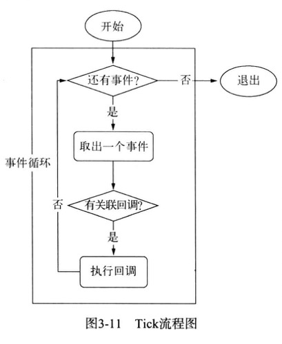

## 《深入浅出Node.js》

## Node简介

### Node的特点
作为后端JavaScript的运行平台，Node保留了前端浏览器JavaScript中那些熟悉的接口，没有改写语言本身的任何特性，依旧基于作用域和原型链，区别在于它将前端中广泛运用的思想迁移到了服务器端。

### Node的应用场景

- I/O密集型

    Node面向网络且擅长并行I/O，能够有效地组织起更多的硬件资源，从而提供更多好的服务。I/O密集的优势主要在于Node利用事件循环的处理能力，而不是启动每一个线程为每一个请求服务，资源占用极少。

- CPU密集型业务

    关于CPU密集型应用，Node的异步I/O已经解决了在单线程上CPU与I/O之间阻塞无法重叠利用的问题，I/O阻塞造成的性能浪费远比CPU的影响小。对于长时间运行的计算，如果它的耗时超过普通阻塞I/O的耗时，那么应用场景就需要重新评估，因为这类计算比阻塞I/O还影响效率，甚至说就是一个纯计算的场景，根本没有I/O。此类应用场景或许应当采用多线程的方式进行计算。Node虽然没有提供多线程用于计算支持，但是还是有以下两个方式来充分利用CPU。

    + Node可以通过编写C/C++扩展的方式更高效地利用CPU，将一些V8不能做到性能极致的地方通过C/C++来实现。

    + 如果单线程的Node不能满足需求，甚至用了C/C++扩展后还觉得不够，那么通过子进程的方式，将一部分Node进程当作常驻服务进程用于计算，然后利用进程间的消息传递结果，将计算与I/O分离，这样还能充分利用多CPU。

### Node的使用者

- 前后端编程语言环境统一
- Node带来的高性能I/O用于实时应用
- 并行I/O使得使用者可以更高效地利用分布式环境
- 并行I/O，有效利用稳定接口提升Web渲染能力
- 云计算平台提供Node支持
- 游戏开发领域
- 工具类应用

## 模块机制

JavaScript的规范依然是薄弱的，还有以下缺点：
1. 没有模块系统
2. 标准库比较少
3. 没有标准接口
4. 缺乏包管理系统

CommonJS规范的提出，主要是为了弥补当前JavaScript没有标准的缺陷，以达到像Python、Ruby和Java具备开发大型应用的基础能力，而不是停留在小脚本程序的阶段。他们期望那些用CommonJ API写出的应用可以具备跨宿主环境执行的能力，这样不仅可以利用JavaScript开发富客户端应用，而且还可以编写以下应用：
- 服务器端JavaScript应用程序
- 命令行工具
- 桌面图形界面应用程序
- 混合应用

### CommonJS的模块规范

> CommonJS对模块对定义十分简单，主要分为模块引用、模块定义和模块标识3个部分。


1. 模块引用

模块引用的示例代码：`var math = require('math');`

在CommonJS规范中，存在require()方法，这个方法接受模块标识，以此引入一个模块的API到当前上下文中。

2. 模块定义

在模块中，上下文提供require()方法来引入外部模块。对应引入的功能，上下文提供了exports对象用于导出当前模块的方法或者变量，并且它是唯一导出的出口。在模块中，还存在一个module对象，它代表模块自身，而exports是module的属性。在Node中，一个文件就是一个模块，将方法挂载在exports对象上作为属性即可定义导出的方式
```javascript
// math.js
exports.add = function() {
    var sum = 0, i = 0, args = arguments, l = args.length;
    while(i < 1) {
        sum += args[i++];
    }
    return sum;
};
```
在另一个文件中，我们通过require()方法引入模块后，就能调用定义的属性或方法了：
```javascript
// program.js
var math = require('math');
exports.increment = function(val) {
    return math.add(val, 1);
}
```

3. 模块标识

模块标识其实就是传递给require()方法的参数，它必须是符合小驼峰命名的字符串，或者.、..开头的相对路径，或者绝对路径。它可以没有文件后缀.js。

模块的定义十分简单，接口也十分简洁。它的意义在于将类聚的方法和变量等限定在私有的作用域中，同时支持引入和导出功能以顺畅地链接上下游依赖。每个模块具有独立的空间，它们互不干扰，在引用时也显得干净利落。

CommonJS构建的这套模块导出和引入机制使得用户完全不必考虑变量污染，命名空间等方案与之相比相形见绌。

### Node的模块实现

Node在实现中并非完全按照规范实现，而是对模块规范进行了一定的取舍，同时也增加了少许自身需要的特性。尽管规范中exports、require和module听起来十分简单，但是Node在实现他们的过程中究竟经历了什么，这个过程需要知晓。

在Node中引入模块，需要经历如下3个步骤。
1. 路径分析
2. 文件定位
3. 编译执行

在Node中，模块分为两类：一类是Node提供的模块，称为核心模块；另一类是用户编写的模块，称为文件模块。

- 核心模块部分在Node源代码的编译过程中，编译进行了二进制执行文件。在Node进程启动时，部分核心模块就被直接加载进内存中，所以这部分核心模块引入时文件定位和编译执行这两个步骤可以省略掉，并且在路径分析中优先判断，所以它的加载速度是最快的

- 文件模块则是在运行时动态加载，需要完整的路径分析、文件定位、编译执行过程，速度比核心模块慢

#### Node的模块加载顺序

1. 优先从缓存加载。Node对引入过的模块会进行缓存，以减少二次引入时的开销。与浏览器缓存不同的是，浏览器仅仅缓存文件，而Node缓存的是编译和执行之后的对象。
2. 核心模块，如http、fs、path等。核心模块的优先级仅次于缓存加载，它在Node的源代码编译过程中已经被编译为二进制代码，其加载过程最快。
3. 路径形式的文件模块。以.、..和/开始的标识符，都被当做文件模块来处理。在分析路径模块时，require()方法会将路径转为真实路径，并以真实路径作为索引，将编译执行后的结果存放到缓存中，以使二次加载时更快。
4. 自定义模块。自定义模块指的是非核心模块，也不是路径形式的标识符。它是一种特殊的文件模块，可能是一个文件或者包的形式。这类模块的查找是最费时的，也是所有方式中最慢的一种。

在Node的所有模块类型中，存在着一种依赖层级关系，即文件模块可能会以来核心模块，核心模块可能会依赖内建模块。通常，不推荐文件模块直接调用内建模块。如需调用，直接调用核心模块即可，因为核心模块中基本都封装了内建模块。

## 异步 I/O

### 异步 I/O 与非阻塞 I/O

​	从实际效果而言，异步和非阻塞都达到了我们并行 I/O 的目的。但是从计算机内核 I/O 而言，异步/同步和阻塞/非阻塞实际上是两回事。

​	操作系统内核对于 I/O 只有两种方式：阻塞与非阻塞。在调用阻塞 I/O 时，应用程序需要等待 I/O 完成才返回结果。阻塞 I/O 的一个特点是调用之后一定要等到系统内核层面完成所有操作后，调用才结束。阻塞 I/O 造成CPU等待 I/O ，浪费等待时间，CPU的处理能力不能得到充分利用。为了提高性能，内核提供了非阻塞 I/O 。非阻塞 I/O 跟阻塞 I/O 的差别为调用之后会立即返回。非阻塞 I/O 返回之后，CPU的时间片可以用来处理其他事务，此时的性能提升是明显的。

​	但非阻塞 I/O 也存在一些问题。由于完整的 I/O 并没有完成，立即返回的并不是业务层期望的数据，而仅仅是当前调用的状态。为了获取完整的数据，应用程序需要重复调用 I/O 操作来确认是否完成，也就是轮询。

#### 事件循环

在进程启动时，Node便会创建一个类似于while(true)的循环，每执行一次循环体的过程称之为Tick。每个Tick的过程就是查看是否有事件待处理，如果有，就取出事件及其相关的回调函数。如果存在关联的回调函数，就执行他们。然后进入下个循环，如果不再有事件处理，就退出进程。



#### 观察者

​	每个事件循环中有一个或多个观察者，而判断是否有事件要处理的过程就是向这些观察者询问是否有要处理的事件。浏览器采用了类似的机制。事件可能来自用户的点击或者加载某些文件时产生，而这些产生的事件都有对应的观察者。在Node中，事件主要来源于网络请求、文件 I/O等，这些事件对应的观察者有文件 I/O 观察者、网络 I/O 观察者等。观察者将事件进行了分类。

​	事件循环是一个典型的***生产者/消费者模型***。异步 I/O、网络请求等则是事件的生产者，源源不断的为Node提供不同类型的事件，这些事件被传递到对应的观察者那里，事件循环则从观察者那里取出事件并处理。

## 异步编程

### 异步编程的解决方案

#### 事件发布/订阅模式

时间监听器模式是一种广泛用于异步编程的模式，是回调函数的事件化，又称发布/订阅模式。

Node自身提供的events模块是发布/订阅模式的一个简单实现，Node中部分模块都继承它，这个模块比前端浏览器中的大量DOM事件简单， 不存在事件冒泡，也不存在 `preventDerault()`，`stopPropagation()`，和`stopImmediatePropagation()`等控制事件传递的方法。它具有`addListener/on()、once()、removeListener()、removeAllListeners()和emit()`等基本的事件监听模式的方法实现。事件发布/订阅的操作极其简单，示例代码如下：

```javascript
// 订阅
emitter.on("event1", function(message) {
	console.log(message);
});
// 发布
emitter.emit('event1', "I am message!");
```

事件发布/订阅模式可以实现一个事件与多个回调函数的关联，这些回调函数又称为事件侦听器。通过`emit()`发布事件后，消息会立即传递给当前事件的所有侦听器执行。侦听器可以很灵活的添加和删除，是的事件和具体处理逻辑之间可以很轻松的关联和解耦。

## 网络编程

​		Node是一个面向网络而生的平台，它具有事件驱动、无阻塞、单线程等特性，具备良好的可伸缩性，使得它十分轻量，适合在分布式网络中扮演各种各样的角色。同时Node提供的API十分贴合网络，适合用它基础的API构建灵活的网络服务。

​		Node提供了net、dgram、http、https这4个模块，分别用于处理TCP、UDP、HTTP、HTTPS，适用于服务器端和客户端。

### TCP 服务的事件

#### 1. 服务器事件

​		对于通过 `net.createServer()` 创建的服务器而言，它是一个 `EventEmitter` 实例，它的自定义事件有如下几种：

```javascript
	- `listening`：在调用 `server.listen()` 绑定端口或者 `Domain Socket` 后触发，简洁写法为 `server.listen(port, listeningListener)` ，通过 `listen()` 方法的第二个参数传入
	- `connection`: 每个客户端套接字连接到服务器端时触发，简洁写法为通过 `net.createServer()` ，最后一个参数传递
	- `close`: 当服务器关闭时触发，在调用`server.close()` 后，服务器将停止接受新的套接字连接，但保持当前存在的连接，等待所有连接都断开后，会触发该事件。
	- `error`: 当服务器发生异常时，将会触发该事件。比如侦听一个使用中的端口，将会触发一个异常，如果不侦听`error`事件，服务器将会抛出异常。
```

#### 2. 连接事件

​		服务器可以同时与多个客户端保持连接，对于每个连接而言是典型的可写可读`Stream`对象。`Stream`对象可以用于服务器端和客户端之间的通信，既可以通过`data`事件从一端读取另一端发来的数据，也可以通过`write()`方法从一端向另一端发送数据。具有如下自定义事件：

```javascript
	- `data`: 当一端调用`write()`发送数据时，另一端会触发`data`事件，事件传递的数据即是`write()`发送的数据
	- `end`: 当连接中的任意一端发送了FIN 数据时，将会触发该事件
	- `connect`: 该事件用于客户端，当套接字与服务器端连接成功时会触发
	- `drain`: 当任意一端调用`write()`发送数据时，当前这端会触发该事件
	- `error`: 当异常发生时，触发该事件
	- `close`: 当套接字完全关闭时，触发该事件
	- `timeout`: 当一定时间后连接不再活跃时，该事件将会被触发，通知用户当前该连接已经被闲置了
```

### HTTP服务的事件

如同TCP服务一样，HTTP服务器也抽象了一些事件，以供应用层使用，同样典型的是，服务器也是一个`EventEmitter`实例。

- `connection`事件：在开始HTTP请求和响应前，客户端与服务器端需要建立底层的TCP连接，这个连接可能因为开启了`keep-alive`，可以在多次请求响应之间使用；当这个连接建立时，服务器触发一次`connection`事件
- `request`事件：建立TCP连接后，http模块底层将在数据流中抽象出HTTP请求和HTTP响应，当请求数据发送到服务器端，在解析出HTTP请求头后，将会触发该事件；在`res.end()`后，TCP连接可能将用于下一次请求响应。
- `close`事件：与TCP服务器的行为一致，调用`server.close()`方法停止接受新的连接，当已有的所有连接都断开时，触发该事件；可以给`server.close()`传递一个回调函数来快速注册该事件。
- `checkContinue`事件：某些客户端在发送较大的数据时，并不会将数据直接发送，而是先发送一个头部带`Expect: 100-continue`的请求到服务器，服务器将会触发`checkContinue`事件；如果没有为服务器监听这个事件，服务器将会自动响应客户端 100 Continue 的状态码，表示接受数据上传；如果不接受数据的较多时，响应客户端 400 Bad Request 拒绝客户端继续发送数据即可。需要注意的是，当该事件发生时不会触发`request`事件，两个事件之间互斥。当客户端收到100 Continue后重新发起请求时，才会触发`request`事件。
- `connect`事件： 当客户端发起CONNECT请求时触发，而发起CONNECT请求通常在HTTP代理时出现；如果不监听该事件，发起该请求的连接将会关闭。
- `upgrade`事件：当客户端要求升级连接的协议时，需要和服务器端协商，客户端会在请求头中带上Upgrade字段，服务器端会在接收到这样的请求时触发该事件。如果不监听该事件，发起该请求的连接将会关闭。
- `clientError`事件：连接的客户端触发`error`事件时，这个错误会传递到服务器端，此时触发该事件。

### HTTP客户端的事件

- `response`： 与服务器端的 `request`事件对应的客户端在请求发出后得到服务器端响应时，会触发该事件。
- `socket`：当底层连接池中建立的连接分配给当前请求对象时，触发该事件
- `connect`：当客户端向服务器端发起CONNECT请求时，如果服务器端响应了200状态码，客户端将会触发该事件。
- `upgrade`：客户端向服务器端发起Upgrade请求时，如果服务器端响应了101 Switching Protocols状态，客户端将触发该事件
- `continue`：客户端向服务器端发起Expect: 100-continue头信息，以试图发送较大数据量，如果服务器端响应100 Continue状态，客户端将触发该事件。

## 总结

​	Node基于事件驱动和非阻塞设计，在分布式环境中尤其能发挥出它的特长，基于事件驱动可以实现与大量的客户端进行连接，非阻塞设计则让它可以更好地提升网络的响应吞吐。Node提供了相对底层的网络调用，以及基于事件的编程接口，使得开发者在这些模块上十分轻松地构建网络应用。	