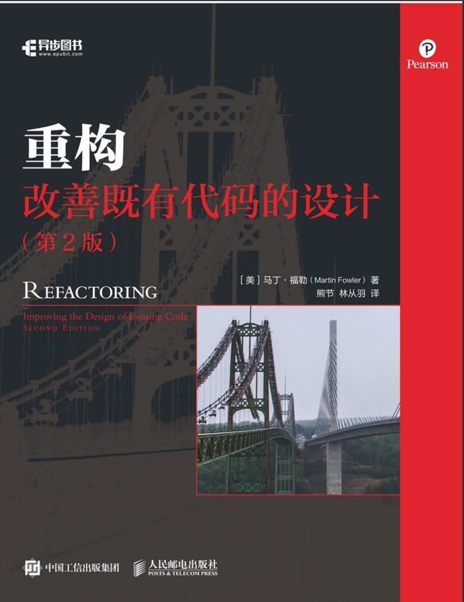

# 重构  改善既有代码的设计

## 什么是重构

> 所谓重构（refactoring）是这样一个过程：在不改变代码外在行为的前提下，对代码做出修改，以改进程序的内部结构。重构是一种经千锤百炼形成的有条不紊的程序整理方法，可以最大限度地减小整理过程中引入错误的概率。本质上说，重构就是在代码写好之后改进它的设计。

“在代码写好之后改进它的设计”这种说法有点奇怪。在软件开发的大部分历史时期，大部分人相信应该先设计而后编码：首先得有一个良好的设计，然后才能开始编码。但是，随着时间的流逝，人们不断修改代码，于是根据原先设计所得的系统，整体结构逐渐衰弱。代码质量慢慢沉沦，编码工作从严谨的工程堕落为胡砍乱劈的随性行为。

“重构”正好与此相反。哪怕手上有一个糟糕的设计，甚至是一堆混乱的代码，我们也可以借由重构将它加工成设计良好的代码。

有了重构以后，工作的平衡点开始发生变化。设计不是在一开始完成的，而是在整个开发过程中逐渐浮现出来。在系统构筑过程中，学会如何不断改进设计。这个“构筑-设计”的反复互动，可以让一个程序在开发过程中有良好的设计。

## 重构的原则

### 何谓重构

### Tips

+ 如果你要给程序添加一个特性，但发现代码因缺乏良好的结构而不易于进行更改，那就先重构那个程序，使其比较容易添加该特性，然后在添加该特性。
+ 重构前，先检查自己是否有一套可靠的测试集。这些测试必须有自我检验能力。
+ 重构技术就是以微小的步伐修改程序。如果你犯下错误，很容易便可发现它。
+ 傻瓜都能写出计算机可以理解的代码。唯有能写出人类容易理解的代码的，才是优秀的程序员。
+ 编程时，需要遵循营地法则：保证你离开时的代码库一定比来时更健康。
+ 好代码的检验标准就是人们是否能轻而易举地修改它。
+ 如果有人说他们的代码在重构过程中有一两天时间不可用，基本上可以确定，他们在做的事不是重构。
+ 