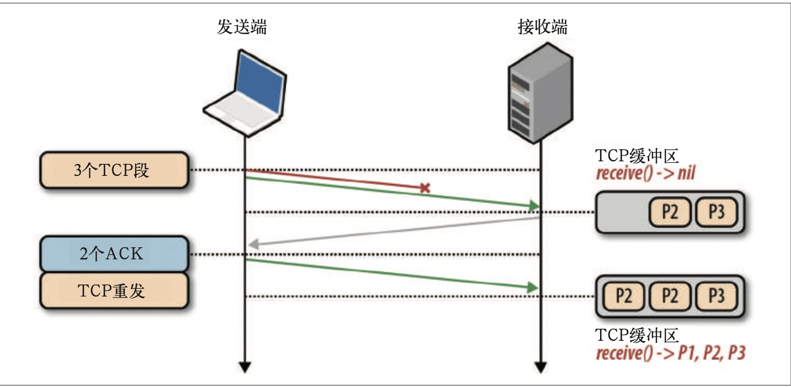

# 《Web性能权威指南》

> 合格的开发者知道怎么做，而优秀的开发者知道为什么那么做。

> 本书中，作者解释了网络编程中的很多为什么：为什么延迟是性能瓶颈？为什么TCP并不总是最优传输机制，而UDP有时候反而是更好的选择？为什么崇勇连接是关键性的优化策略？然后又更进一步的给出了网络性能的具体建议。想要降低延迟？在靠近客户端的服务器上完成会话。想要提高连接重用率？保持连接持久化。除此之外，本书还讲解了协议和浏览器的最新进展。讲了HTTP 2.0的诸多有点，回顾了XHR及其催生的CORS(Cross-Origin Resource Sharing, 跨域资源共享)的局限性，还有SSE(Server-Sent Events, 服务器发送事件)、WebSockets 和 WebRTC。

## 第一部分  网络技术概览

### 第一章   延迟和带宽

#### 速度是关键

1. 在这个节奏越来越快、联系越来越紧密的世界，追求速度不仅仅是一种心理上的需要，更是一种由现实事例驱动的用户需求。很多在线公司的业绩已经证实：
 - 网站越快，用户的黏性越高；
 - 网站越快，用户忠诚度越高；
 - 网站越快，用户转换率越高；
对所有网络通信都有决定性影响的两个方面：延迟和带宽
+ 延迟
  分组从信息源发送到目的地所需的时间
+ 带宽
  逻辑或物理通信路径最大的吞吐量


  
2. 延迟的构成
    延迟是消息(message)或分组(packet)从起点到终点经历的时间。路由器这个负责在客户端和服务器之间转发消息的设备，会牵涉哪些影响延迟的因素有
    - 传播延迟
        消息从发送端到接收端需要的时间，是信号转播距离和速度的函数
    - 传输延迟
        把消息中的所有比特转移到链路中需要的时间，是消息长度和链路速率的函数
    - 处理延迟
        处理分组首部、检查位错误及确定分组目标所需的时间
    - 排队延迟
        到来的分组排队等待处理的时间
    以上延迟的时间总和，就是客户端到服务器的总延迟时间。传播时间取决于距离和信号通过的媒介，另外传播速度通常不超过光速。而传输延迟由传输链路的速率决定，与客户端到服务器的距离无关。接着，分组到达路由器。路由器必须检测分组的首部，以确定出站路由，并且还可能对数据进行检查，这些都要花时间。由于这些检查通常由硬件完成，因此相应的延迟一般非常短，但再短也还是存在。最后，如果分组到达的速度超过了路由器的处理能力，那么分组就要在入站缓冲区排队。数据在缓冲区排队等待的时间就是排队延迟。
    每个分组在通过网络时都会遇到这样或那样的延迟。发送端与接收端的距离越远，传播时间就越长。一路上经过的路由器越多，每个分组的处理和传输延迟就越多。最后，网络流量越拥挤，分组在入站缓冲区中被延迟的可能性就越大。

3. 光速与传播延迟
    要想给用户最佳的体验，而且保证他们会全神贯注于手边的任务，我们的应用必须在几百ms之内响应。这几乎没有给我们——特别是网络，留出多少出错的余地。若要成功，必须认真对待网络延迟，在每个开发阶段都为它设立明确的标准。
    CDN(Content Delivery Network, 内容分发网络)服务的用途很多，但是重要的就是通过把内容部署在全球各地，让用户从最近的服务器加载内容，大幅降低传播分组的时间。

4. 延迟的最后一公里
    大多数网站性能的瓶颈都是延迟，而不是带宽！

5. 网络核心的带宽
    通过波分复用(WDM,Wavelength-Division Multiplexing)技术，光纤可以同时传输很多不同波长（通道）的光，因而具有明显的带宽优势。一条光纤连接的总带宽，等于每个信道的数据传输速率乘以可复用的信道数。

6. 网络边缘的带宽
    用户可用带宽取决于客户端与目标服务器间最低容量连接。由于请求密集、硬件故障、网络攻击，以及其他很多原因，网络的某个中间节点随时都有可能发生拥塞。吞吐量和延迟波动大是因特网固有的特点。

7. 目标：高带宽和低延迟
    目前的视频流量已经占到全部因特网流量的一半以上，人们对高带宽的需求迅速增长。我们可以使用在光纤链路中部署更多光纤、在拥塞的路由之间铺设更多线路甚至是改进WDM技术等方法来提高容量，以便让现有连接能够传输更多数据。但是减少延迟相对来说就要困难得多，通过提升光纤线路的质量来让光信号传输的速度更接近光速。比如采用折射率更低的材料、速度更快的路由器和中继器等。


### 第二章   TCP的构成

因特网有两个核心协议：IP和TCP。IP，即Internet Protocol(因特网协议)，负责联网主机之间的路由选择和寻址；TCP，即Transmission Control Protocol(传输控制协议)，负责在不可靠的传输信道之上提供可靠的抽象层。TCP/IP也常被称为“因特网协议套件”(Internet Protocol Suite).

TCP负责在不可靠的传输信道之上提供可靠的抽象层，向应用层隐藏了大多数网络通信的复杂细节，比如丢包重发、按序发送、拥塞控制及避免、数据完整等等。采用TCP数据流可以确保发送的所有字节能够完整地被接收到，而且到达客户端的顺序也一样。也就是说，TCP专门为精确传送做了优化，但并未过多顾及时间。

#### 2.1 三次握手

所有TCP连接一开始都要经过三次握手。客户端与服务器在交换应用数据之前，必须就起始分组序列号，以及其他一些连接相关但细节达成一致，出于安全考虑，序列号有两端随机生成。


- SYN
    
    客户端选择一个随机序列号x，并发送一个SYN分组，其中可能还包括其他TCP标志和选项。
- SYN ACK
    服务器给x加1，并选择自己的一个随机序列号y，追加自己的标志和选项，然后返回响应。
- ACK
    客户端给x和y加1并发送握手期间的最后一个ACK分组

三次握手完成后，客户端与服务器之间就可以通信了。客户端可以在发送ACK分组之后立即发送数据，而服务器必须等接收到ACK分组之后才能发送数据。这个启动通信的过程适用于所有TCP连接，因此对所有使用TCP的应用具有费城大的性能影响，因为每次传输应用数据之前，都必须经历一次完整的往返。

三次握手带来的延迟使得每创建一个新TCP连接都要付出很大代价。而这也决定了提高TCP应用性能的关键，在于想办法重用连接。

#### 2.2 拥塞预防及控制

##### 2.2.1 流量控制

流量控制是一种预防发送端过多向接收端发送数据的机制。否则，接收端可能因为忙碌、负载重或缓冲区既定而无法处理。为实现流量控制，TCP连接的每一方都要通告自己的接收窗口（rwnd），其中包含能够保存数据的缓冲区空间大小信息。

第一次建立连接时，两端都会使用自身系统的默认设置来发送rwnd。浏览网页通常主要是从服务器向客户端下载数据，因此客户端窗口更可能称为瓶颈。然而，如果是在上传图片或视频，即客户端向服务器传送大量数据时，服务器的接收窗口又可能成为制约因素。

不管怎样，如果其中一端跟不上数据传输，那它可以向发送端通告一个较小的窗口。如果窗口为零，则意味着必须由应用层先清空缓冲区，才能再接收剩余数据。这个过程贯穿于每个TCP连接的整个生命周期：每个ACK分组都会携带相应的最新rwnd值，以便两端动态调整数据流速，使之适应发送端和接收端的容量和处理能力。

##### 2.2.2 慢启动

尽管TCP有了流量控制机制，但网络拥塞崩溃仍然在1980年代中后期浮出水面。流量控制确实可以防止发送端向接收端发送过多数据，但却没有机制预防任何一端向潜在网络发送过多数据。换句话说，接收端和发送端在连接建立之初，谁也不知道可用带宽是多少，因此需要一个估算机制，然后还要根据网络中不断变化的条件而动态改变速度。

慢启动算法的设计思路就是根据交换数据来估算客户端于服务器之间的可用带宽。首先，服务器通过TCP连接初始化一个新的拥塞窗口（cwnd）变量，将其值设置为一个系统设定的保守值。

- 拥塞窗口大小（cwnd）

  发送端对客户端接收确认（ACK）之前可以发送数据量的限制。

新的TCP连接传输的最大数据量取rwnd和cwnd中的最小值，而服务器实际上可以向客户端发送4个TCP 段，然后就必须停下来等待确认。此后，每收到一个ACK，慢启动算法就会告诉服务器可以将它的cwnd窗口增加一个TCP段。每次收到ACK后，都可以发送两个新的分组。TCP连接的这个阶段通常被称为“指数增长”阶段。因为客户端和服务器都在向两者之间网络路径的有效带宽靠拢。

为什么知道有个慢启动对我们构建浏览器应用这么重要呢？因为包括HTTP在内的很多应用层协议都运行在TCP之上，无论带宽多大，每个TCP连接都必须经过慢启动阶段。换句话说，我们不可能一上来就完全利用连接的最大带宽。

相反，我们要从一个相对较小的拥塞窗口开始，每次往返都令其翻倍（指数式增长）。而达到某个目标吞吐量所需的时间，就是客户端和服务器之间的往返时间和初始拥塞窗口大小的函数。

慢启动导致客户端于服务器之间经过几百ms才能达到接近最大速度的问题，对于大型流式下载服务的影响倒不显著，因为慢启动的时间可以分摊到整个传输周期内消化掉。

可是，对于很多HTTP连接，特别是一些短暂、突发的连接而言，常常会出现还没有达到最大窗口请求就被终止的情况。换句话说，很多web应用的性能经常受到服务器于客户端之间往返时间的制约。因为慢启动限制了可用的吞吐量，而这对于小文件传输非常不利。

##### 2.2.3 拥塞预防

拥塞预防算法把丢包作为网络拥塞的标志，即路径中某个连接或路由器已经拥堵了，以至于必须采取删包措施。因此，必须调整窗口大小，以避免造成更多的包丢失，从而保证网络畅通。

重置拥塞窗口后，拥塞预防机制按照自己的算法来增大窗口以尽量避免丢包。某个过程，有可能又有包丢失，于是这个过程再从头开始。

#### 2.3 带宽延迟积

TCP内置的拥塞控制和预防机制对性能还有另一个重要影响：发送端和接收端理想的窗口大小，一定会因往返时间及目标传输速率而变化。

因为发送端和接收端之间在途未确认的最大数据量，都必须停下来等待另一方ACK确认某些分组才能继续。需要等待的时间取决于往返时间。
+ BDP(Bandwidth-delay product, 带宽延迟积)
    
    数据链路的容量与其端到端延迟的乘积。这个结果就是任意时刻处于在途未确认状态的最大数据量。

发送端或接收端无论谁被迫频繁地停止等待之前的分组的ACK，都会造成数据缺口，从而必然限制连接的最大吞吐量。为解决这个问题，应该让窗口足够大，以保证任何一端都能在ACK返回前持续发送数据。只有传输不中断，才能保证最大吞吐量。而最优窗口大小取决于往返时间！无论实际或通告的带宽是多大，窗口过小都会限制连接的吞吐量。

#### 2.4 队首阻塞

TCP在不可靠的信道上实现了可靠的网络传输。基本的分组错误检测与纠正、按序交付、丢包重发，以及保证网络最高效率的流量控制、拥塞控制和预防机制，让TCP成为大多数网络应用中最常见的传输协议。

虽然TCP很流行，但它并不是唯一但选择，而且在某些情况下也不是最佳的选择，特别是按序交付和可靠交付有时候并不必要，反而会导致额外的延迟，对象能造成负面影响。因为每个TCP分组都会带着一个唯一的序列号被发出，而所有分组必须按顺序传送到接收端。如果中途有一个分组没能到达接收端，那么后续分组必须保存在接收端的TCP缓冲区，等待丢失的分组重发并到达接收端。这一切都发生在TCP层，应用程序对TCP重发和缓冲区中排队的分组一无所知，必须等待分组全部到达才能访问数据。在此之前，应用程序只能通过套接字读取数据时感觉到延迟交付。这种效应称为TCP的队首(HOL, Head of Line)阻塞。

队首阻塞造成的延迟可以让我们的应用程序不用关心分组重排和重组，从而让代码保持简洁。然而，代码简洁也是要付出代价的，那就是分组到达时间会存在无法预知的延迟变化。这个时间变化通常被称为抖动，也是影响应用程序性能的一个主要因素。

另外，有些应用程序可能并不需要可靠的交付或者不需要按序交付。比如，每个分组都是独立的消息，那么按序交付就没有任何必要。而且，如果每个消息都会覆盖之前的消息，那么可靠交付也同样没有必要了。可惜的是，TCP不支持这种情况，所有分组都必须按序交付。

无需按序交付数据或能够处理分组丢失的应用程序，以及对延迟或抖动要求很高的应用程序，最好选择UDP等协议。

#### 2.5 针对TCP的优化建议

TCP是一个自适应的、对所有网络节点一视同仁的、最大限制利用底层网络的协议。因此，优化TCP的最佳途径就是调整它感知当前网络状况的方式，根据它之上或之下的抽象层的类型和需求来改变它的行为。无线网络可能需要不同的拥塞算法，而某些应用程序可能需要自定义服务品质(QoS,Quality of Service)的含义，从而交付最佳的体验。

尽管每个算法和反馈机制的具体细节可能会继续发展，但核心原理以及它们但影响是不变的：
- TCP三次握手增加了整整一次往返时间
- TCP慢启动将被应用到每个新连接
- TCP流量及拥塞控制会影响所有连接的吞吐量
- TCP的吞吐量由当前拥塞窗口大小控制

大多数情况下，TCP的瓶颈都是延迟而非带宽。

##### 2.5.1 服务器配置调优

在着手调整TCP缓冲区、超时等数十个变量之前，最好先把主机操作系统升级到最新版本。TCP的最佳实践以及影响其性能的底层算法一直在与时俱进，而且大多数变化都只在最新内核中才有实现。一句话，让你的服务器跟上时代是优化发送端和接收端TCP栈的首要措施。
- 增大TCP的初始拥塞窗口
    
    加大起始拥塞窗口可以让TCP在第一次往返就传输较多数据，而随后的速度提升也会很明显。对于突发性的短暂连接，这也是特别关键的一个优化。
- 慢启动重启

    在连接空闲时禁用慢启动可以改善瞬时发送数据的长TCP连接的性能。
- 窗口缩放

    启用窗口缩放可以增大最大接受窗口大小，可以让高延迟的连接达到更好吞吐量。
- TCP快速打开

    在某些条件下，允许在第一个SYN分组中发送应用程序数据。TFO(TCP Fast Open)是一种新的优化选项，需要客户端和服务器共同支持。为此，首先要搞清楚你的应用程序是否可以利用这个特性。
以上几个设置再加上最新的内核，可以确保最佳性能：每个TCP连接都会具有较低的延迟和较高的吞吐量。

##### 2.5.2 应用程序行为调优

调优TCP性能可以让服务器和客户端之前达到最大吞吐量和最小延迟。而应用程序如何使用新的或已经建立的TCP连接同样也有很大的关系。
- 再快也快不过什么也不用发送，能少发就少发
- 我们不能让数据传输更快，但可以让它们传输的距离更短
- 重用TCP连接是提升性能的关键

当然，消除不必要的数据传输本身就是很大的优化。比如减少下载不必要的资源，或者通过压缩算法把要发送的比特数降到最低。然后，通过在不同地区部署服务器（比如使用CDN），把数据放到接近客户端的地方，可以减少网络往返的延迟，从而显著提升TCP性能。最后，尽可能重用已建立的TCP连接，把慢启动和其他拥塞控制机制的影响降到最低。

##### 2.2.6 性能检查清单

优化TCP性能的回报是丰厚的，无论什么应用，性能提升可以在与服务器的每个连接中体现出来。
- 把服务器内核升级到最新版本
- 确保cwnd大小为10
- 禁用空闲后的慢启动
- 确保启动窗口缩放
- 减少传输冗余数据
- 压缩要传输的数据
- 把服务器放到离用户最近的地方以减少往返时间
- 尽最大可能重用已经建立的TCP连接


### 第三章 UDP的构成
#### 3.1 无协议服务

UDP协议会用自己的分组结构封装用户消息，它只增加了4个字段：源端口、目标端口、分组长度和校验和。这样，当IP把分组送达目标主机时，该主机能够拆开UDP分组，根据目标端口找到目标应用程序，然后再把消息发送过去。仅此而已。

事实上，UDP数据报中的源端口和校验和字段都是可选的。IP分组的首部也有校验和，应用程序可以忽略UDP校验和。也就是说，所有错误检测和错误纠正工作都可以委托给上层的应用程序。说到底，UDP仅仅是在IP层之上通过嵌入应用程序的源端口和目标端口，提供了一个“应用程序多路复用”机制。
- 不保证消息交付

    不确认，不重传，无超时

- 不保证交付顺序
    
    不设置包序号，不重排，不会发生队首阻塞

- 不跟踪连接状态

    不必建立连接或重启状态机

- 不需要拥塞控制

    不内置客户端或网络反馈机制

TCP是一个面向字节流的协议，能够以多个分组形式发送应用程序消息，并且对分组中的消息范围没有任何明确限制。因此，连接的两端存在一个连接状态，每个分组都有序列号，丢失还要重发，并且要按顺序交付。相对来说，UDP数据报有明确的限制：数据报必须封装在IP分组中，应用程序必须读取完整的消息。换句话说，数据包不能分片。

UDP是一个简单、无状态的协议，适合作为其他上层应用协议的辅助。实际上，这个协议的所有决定都需要由上层的应用程序作出。

### 第四章 传输层安全（TLS）

SSL(Secure Sockets Layer，安全套接字层)协议最初是网景公司为了保障网上交易安全而开发的，该协议通过加密来保护客户个人资料，通过认证和完整性检查来确保交易安全。为达到这个目标，SSL协议在直接位于TCP上一层的应用层被实现。SSL不会影响上层协议（如HTTP、电子邮件、即时通讯），但能够保证上层协议的网络通信安全。


在正确使用SSL的情况下，第三方监听者只能推断出连接的端点、加密类型，以及发送数据的频率和大致数量，不能实际读取或修改任何数据。


#### 4.1 加密、身份验证与完整性

TLS协议的目标是为在它之上运行的应用提供三个基本服务：加密、身份验证和数据完整性。从技术角度讲，并不是所有情况下都要同时使用这三个服务。比如，可以接受证书但不验证其真实性，而前提是你非常清楚这样做有什么安全风险且有防范措施。实践中，安全但Web应用都会利用这三个服务。

- 加密
    
    混淆数据的机制

- 身份验证

    验证身份标识有效性的机制

- 完整性

    检测消息是否被篡改或伪造的机制

为了建立加密的安全数据通道，连接双方必须就加密数据的密钥套件和密钥协商一致。TLS协议规定了一套严密的握手程序用于交换这些信息。握手机制中设计最巧妙的地方就是其使用的公钥密码系统，这套系统可以让通信双方不必事先”认识“即可商定共享的安全密钥，而协商的过程还是通过非加密通道完成的。

握手过程中，TLS协议还允许通信两端互相验明正身。在浏览器中，验证机制允许客户端验证服务器就是它想联系的那个，而不是通过名字或IP地址伪装的目标。此外，服务器也可以选择验证客户端的身份。

除了密钥协商和身份验证，TLS协议还提供了自己的消息分帧机制，使用MAC(Message Authentication Code, 消息验证码)签署每一条消息。MAC算法是一个单向加密的散列函数（本质上是一个校验和），密钥由连接双方协商确定。只要发送TLS记录，就会生成一个MAC值并附加到该消息中。接收端通过计算和验证这个MAC值来判断消息的完整性和可靠性。

上述三种机制为Web通信构建了一个安全的环境。所有现代Web浏览器都支持多种加密套件，能够验证客户端和服务器，并能对每条记录进行消息完整性检查。

#### 4.2 TLS握手

客户端与服务器在通过TLS交换数据之前，必须协商建立加密信道。协商内容包括TLS版本、加密套件，必要时还会验证证书。然而，协商过程的每一步都需要一个分组在客户端和服务器之间往返一次，因而所有TLS连接启动时都要经历一定的延迟。


## 第三部分 HTTP

### 第十章 Web性能要点

#### 10.1 超文本、网页和Web应用

- 超文本文档

    万维网就起源于超文本文档，一种只有基本格式，但支持超链接的纯文本文档。按照现代眼光来看，这种文档或许没什么值得大惊小怪的，但它验证了万维网的假设、前景及巨大的实用价值。

- 富媒体网页

    HTML工作组和早期的浏览器开发商扩展了超文本，使其支持更多的媒体，如图片和音频，同时也为丰富布局增加了很多手段。网页时代到来了，我们可以基于不同的媒体构建可见的页面布局了。但网页还只是看起来漂亮，很大程度上没有交互功能，与可打印的页面没有区别。

- Web应用

    JavaScript及后来DHTML和Ajax的加入，再一次革命了Web，把简单的网页转换成了交互式Web应用。Web应用可以在浏览器中直接响应用户操作。于是，Outlook Web Access等最早的、成熟的浏览器应用出现，也揭开了脚本、样式表和标记文档之间复杂依赖的新时代。

富媒体网页的出现改变使得一个简单的文档变成了文档加依赖资源。因此，HTTP 1.0引入了HTTP元数据的表示法（首部），HTTP 1.1 又加入了各种旨在提升性能的机制，如缓存、持久连接，等。事实上，多TCP连接目前仍然存在，性能的关键指标已经从文档加载时间变成了页面加载时间，常简写为PLT(Page Load Time)。

最后，Web应用把网页的简单依赖关系转换成了复杂的依赖关系：标记定义结构、样式表定义布局，而脚本构建最终的交互式应用，响应用户输入，并在交互期间创建样式表和标记。

结果，页面加载时间，这个一直以来衡量Web性能的事实标准，作为一个性能基础也越来越显得不够了。我们不再是构建网页，而是在构建一个动态、交互的Web应用。

#### 10.2 速度、性能与用户期望

速度和性能是两个相对的概念。每个应用都要满足自己特定的需求，因为商业条件、应用场景、用户期望，以及功能复杂性各不相同。尽管如此，如果应用必须对用户作出响应，那我们就必须从用户角度来考虑可感知的处理时间这个常量。


每一个HTTP请求都由很多独立的阶段构成：DNS解析、TCP连接握手、TLS协商、发送HTTP请求，然后下载内容。这些阶段的时长在不同的浏览器中会略有不同。

#### 10.3 性能来源：计算、渲染和网络访问

Web应用的执行任务主要涉及三个任务：取得资源、页面布局和渲染、JavaScript执行。其中，渲染和脚本执行在一个线程上交错进行，不可能并发修改生成的DOM。实际上，优化运行时的渲染和脚本执行时至关重要的。

#### 10.5 针对浏览器的优化建议

可优化的手段会因浏览器而异，但从核心优化策略来说，可以宽泛地分为两类

- 基于文档的优化

    熟悉网络协议，了解文档、CSS和JavaScript解析管道，发现和优先安排关键网络资源，尽早分派请求并取得页面，使其尽快达到可交互的状态。主要方法是优先获取资源、提前解析等。

- 推测性优化

    浏览器可以学习用户的导航模式，执行推测性优化，尝试预测用户的下一次操作。然后，预先解析DNS、预先连接可能的目标。

好消息是，所有这些优化都由浏览器替我们自动完成，经常可以节省几百ms的网络延迟。既然如此，那理解这些优化背后的原理就至关重要了，这样才能利用浏览器的这些特性，提升应用性能。大多数浏览器都利用了如下四种技术

- 资源预取和排定优先次序

    文档、CSS和JavaScript解析器可以与网络协议层沟通，声明每种资源的优先级：初始渲染必需的阻塞资源具有最高优先级，而低优先级的请求可能会被临时保存在队列中。

- DNS预解析

    对可能对域名进行提前解析，避免将来HTTP请求时的DNS延迟。预解析可以通过学习导航历史、用户的鼠标悬停，或其他页面信号来触发。

- TCP预连接

    DNS解析之后，浏览器可以根据预测的HTTP请求，推测性的打开TCP连接。如果猜对的话，则可以节省一次完整的往返时间。

- 页面预渲染

    某些浏览器可以让我们提示下一个可能的目标，从而在隐藏的标签页中预先渲染整个页面。这样，当用户真的触发导航时，就能立即切换过来。

从外部看，现代浏览器的网络协议实现以简单的资源获取机制的面目示人，而从内部来说，它又极为复杂精密，为了解如何优化性能，非常值得深入钻研。那么在探寻的过程中，我们怎么利用浏览器的这些机制呢？首先，要密切关注每个页面的结构和交互：

- CSS和JavaScript等重要资源应该尽早在文档中出现；
- 应该尽早交付CSS，从而解除渲染阻塞并让JavaScript执行；
- 非关键性JavaScript应该推迟，以避免阻塞DOM和CSSOM构建；
- HTML文档由解析器递增解析，从而保证文档可以间隙性发送，以求得最佳性能。

除了优化页面结构，还可以在文档中嵌入提示，以触发浏览器为我们采用其他优化机制：
```
<link rel="dns-prefetch" href="//hostname_to_resolve.com">    // 预解析特定的域名
<link rel="subresource" href="/main.js">                      // 预取得页面后面要用到的关键性资源
<link rel="prefetch" href="/img/big.jpg">                     // 预取得将来导航要用的资源
<link rel="prerender" href="//example.org/next_page.html">    // 根据对用户下一个目标的预测，预渲染特定页面
```

对大多数用户甚至Web开发者而言，DNS、TCP和SSL延迟完全不可见，它们都是在网络层协商确定的，我们中很少有人关注它们。然而，这其中每一步都关乎整体的用户体验，因为每一次额外的网络往返都会增加几十甚至几百ms的网络延迟。通过帮助浏览器预测这些往返，可以消除这些瓶颈，从而向用户交付更快更好的体验。


## 第十三章  优化应用的交付

高性能浏览器网络依赖于大量网络技术，而我们应用的整体性能则是所有这些组成部分性能表现之和。

我们无法控制客户端与服务器之间的网络环境，也不能控制客户的硬件或者其手持设备的配置，但除此之外的一切就掌握在我们手里了，包括服务器上的TCP和TLS优化，以及针对不同物理层特性、不同HTTP协议版本和通用最佳时间的数十项应用优化。

通信信道的物理属性对所有应用而言都是一项硬性限制：光速及客户端与服务器之间的距离决定了信号传播的延迟，而媒介（有线或无线）决定了由每个数据分组带来的处理、传输、排队及其他延迟。事实上影响绝大多数Web应用性能的并非带宽，而是延迟。网速虽然越来越快，但不幸的是，延迟似乎并没有缩短。

既然我们不能让信息跑的更快，那么关键就在于对传输层和应用层采取各种可能的优化手段，消除不必要的往返、请求，吧每个分组的传输距离缩到最短——比如吧服务器放到离客户更近的地方。

针对无线网络物理层的特有属性采取优化措施可以让任何应用受益，因为无线环境的延迟高且带宽总是那么贵。对API而言，有线与无线网络之间的差别特别明显，对此视而不见可不明智。只要对何时以及如何下载资源、信标进行简单的优化，就能显著改善用户感觉到的延迟、电池使用时间和应用的整体用户体验。

自物理层向上，接下来就是要保证任何一台服务器都要按照最新的TCP和TLS最佳实践进行配置。针对底层协议的优化能保证每个客户端在与服务器通信时，都可以获取最佳性能——高吞吐量和第延迟。

最后，就是应用层。无论从哪个角度讲，HTTP都是出奇成功的一个协议。毕竟，它是数十亿客户端与服务器交流的“通用语言”，没有它就没有现代Web。可是，HTTP也是一个不完美的协议，这就意味着我们在架构自己的应用时必须格外小心。

### 13.1 经典的性能优化最佳实践

无论什么网络，也不管所用网络协议是什么版本，所有应用都应该致力于消除或减少不必要的网络延迟，将需要传输的数据压缩至最少。这两条标准是经典的性能优化最佳实践，是其他数十条性能准则的出发点。

- 减少DNS查找

    每一次主机名解析都需要一次网络往返，从而增加请求的延迟时间，同时还会阻塞后续请求。

- 重用TCP连接

    尽可能使用持久连接，以消除TCP握手和慢启动延迟。

- 减少HTTP重定向

    HTTP重定向极费时间，特别是不用域名之间的重定向，更加费时；这里面既有额外的DNS查询、TCP握手，还有其他延迟。最佳的重定向次数为零。

- 使用CDN

    把数据放到离用户地理位置更近的地方，可以显著减少每次TCP连接的网络延迟，增大吞吐量。这一条既适用于静态内容，也适用于动态内容。

- 去掉不必要的资源

    任何请求都不如没有请求快。

- 在客户端缓存资源

    应该缓存应用资源，从而避免每次请求都发送相同都内容。

- 传输压缩过的内容

    传输前应该压缩应用资源，把要传输的字节减至最少：确保对每种要传输的资源采用最好的压缩手段。

- 消除不必要的请求开销

    减少请求的HTTP首部数据（如HTTP cookie），节省的时间相当于几次往返的延迟时间。

- 并行处理请求和响应

    请求和响应的排队都会导致延迟，无论是客户端还是服务器段。这一点经常被忽视，但却会无谓地导致很长延迟。

- 针对协议版本采取优化措施

    HTTP 1.x 支持有限的并行机制，要求打包资源、跨域分散资源，等等。相对而言，HTTP 2.0 只要建立一个连接就能实现最优性能，同时无需针对HTTP 1.x的那些优化方法。

#### 13.1.1 在客户端缓存资源

要说最快的网络请求，那就是不用发送请求就能获取资源。将之前下载过的数据缓存并维护好，就可以做到这一点。对于通过HTTP传输的资源，要保证首部包含适当的缓存字段：

- Cache-Control   首部用于指定缓存时间
- Last-Modified 和 ETag  首部提供验证机制 

只要可能，就给每种资源都指定一个明确的缓存时间。这样客户端就可以直接使用本地副本，而不必每次都请求相同的内容。类似的，指定验证机制可以让客户端检查国旗的资源是否有更新。没有更新，就没有必要重新发送。

最后，还要注意应同时指定缓存时间和验证方法！只指定其中之一是最常见的错误，于是要么导致每次都在没有更新的情况下重发相同内容（因为没有指定验证），要么导致每次使用资源时都多余地执行验证检查（没有指定缓存时间）。

#### 13.1.2 压缩传输的数据

利用本地缓存可以让客户端避免每次请求都重复取得数据。不过，还是有一些资源是必须取得的，比如原来的资源过期了，或者有新资源，再或者资源不能缓存。对于这些资源，应该保证传输的字节数最少。因此要保证对它们进行最有效的压缩。

HTML、CSS和JavaScript等文本资源的大小经过压缩平均可以减少60%-80%。而图片则需要仔细考量：
- 图片一般会占到一个网页需要传输的总字节数的一般；
- 通过去掉不必要的元数据可以把图片文件变小；
- 要调整大小就在服务器上调整，避免传输不必要的字节；
- 应该根据图像选择最优的图片格式；
- 尽可能使用有损压缩。

#### 13.1.3 消除不必要的请求字节

应该认真对待和监控cookie的大小，确保只传输最低数量的元数据，比如安全会话令牌。同时，还应该利用服务器上共享的会话缓存，从中查询缓存的元数据。更好的结果，则是完全不用cookie。比如，在请求图片、脚本和样式表等静态资源时，浏览器绝大多数情况下不必传输特定于客户端的元数据。

### 13.2 针对HTTP1.x的优化建议

针对HTTP1.x的优化次序很重要：首先要配置服务器以最大限度的保证TCP和TLS的性能最优，然后再谨慎地选择和采用移动及经典的应用最佳实践，之后再度量、迭代。

- 利用HTTP管道

    如果你的应用可以控制客户端和服务器这两端，那么使用管道可以显著减少网络延迟。

- 采用域名分区

    如果你的应用性能受限于默认的每来源6个连接，可以考虑将资源分散到多个来源。

- 打包资源以减少HTTP请求

    拼接和精灵图等技术有助于降低协议开销，又能达成类似管道的性能提升。

- 嵌入小资源

    考虑直接在父文档中嵌入小资源，从而减少请求数量。

管道缺乏支持，而其他优化手段又各有各的利弊。事实上，这些优化措施如果过于激进或使用不当，反倒会伤害性能。总之，要有务实的态度，通过度量来评估各种措施对性能的影响，在此基础上再迭代改进。

### 13.3 针对HTTP2.0的优化建议

HTTP 2.0 的主要目标就是提升传输性能，实现客户端与服务器间较低的延迟和较高的吞吐量。显然，在TCP和TLS之上实现最佳性能，同时消除不必要的网络延迟，从来没有如此重要过。最低限度：
- 服务器的初始cwnd应该是10个分组
- 服务器应该通过ALPN协商支持TLS
- 服务器应该支持TLS恢复以最小化握手延迟

接下来就是采用移动及其他经典的最佳做法：少发数据、削减请求，根据无线网络情况调整资源供给。不管使用什么版本的协议，减少传输的数据量和消除不必要的网络延迟，对任何应用都是最有效的优化手段。

最后，杜绝和忘记域名分区、文件拼接、图片精灵等不良的习惯，这些做法在HTTP 2.0 之上完全没有必要。事实上，继续使用这些手段反而有害。可以利用HTTP 2.0内置的多路分发以及服务器推送等新功能。


# 第四部分 浏览器API与协议

## 第14章 浏览器网络概述

浏览器乃至运行在其中的应用的性能，取决于若干组件：解析、布局、HTML与CSS的样式计算、JavaScript执行速度、渲染管道，当然还有网络相关各层协议的配合。其中每个组件的角色都很重要，而网络组件通常是加倍重要，因为浏览器慢就慢在等待网络资源上，等待造成后续环节被阻塞。

设计Web应用时，我们不必关心个别的TCP或UDP套接字，浏览器会替我们管理它们。而且，网络组件会帮我们施加恰当的连接限制、格式化请求、隔离应用、管理代理、缓存，等等。

### 14.1 连接管理与优化

运行在浏览器中的Web应用并不负责管理个别网络套接字的生命周期，通过把这个任务委托给浏览器，可以自动化很多重要的性能优化任务，包括套接字重用、请求优先级排定、晚绑定、协议协商、施加连接数量限制等等。事实上，浏览器是有意把请求管理生命周期与套接字管理分开的。

自动化的套接字池管理会自动重用TCP连接，从而有效保障性能。除此之外，这种架构设计还提供了其他优化机会：
- 浏览器可以按照优先次序发送排队请求
- 浏览器可以重用套接字以最小化延迟并提升吞吐量
- 浏览器可以预测请求提前打开套接字
- 浏览器可以优化何时关闭空闲套接字
- 浏览器可以优化分配给所有套接字的带宽

### 14.2 网络安全与沙箱

将个别套接字的管理任务委托给浏览器还有另一个重要的用意：可以让浏览器运用沙箱机制，对不受信任的应用代码采取一致的安全与策略限制。

- 连接限制

    浏览器管理所有打开的套接字池并强制施加连接数限制，保护客户端和服务器的资源不会被耗尽。

- 请求格式化与响应处理

    浏览器格式化所有外发请求以保证格式一致和符合协议的语义，从而保护服务器。类似的，响应解码也会自动完成，以保护用户。

- TLS协商

    浏览器执行TLS握手和必要的证书检查。任何证书有问题，用户都会收到通知。
- 同源策略

    浏览器会限制应用只能向哪个来源发送请求


### 14.4 应用API与协议

在浏览器提供的网络服务的最上层，就是应用API和协议。前面介绍了下层提供的各种重要服务：套接字和连接管理、请求和响应处理、各种安全机制、缓存等等。我们每次发起HTTP或XMLHttpRequest请求，或者长Server-Sent Event或者WebSocket会话，或者打开WebRTC连接，都需要与其中一些或全部底层服务打交道。

XHR(XMLHttpRequest)是浏览器层面的API，可以让开发人员通过JavaScript实现数据传输。XHR是AJAX(Asyncchronous JavaScript and XML)革命的核心技术，是今天几乎所有Web应用必不可少的基本构件。

XHR诞生以前，网页要获取客户端和服务器的任何状态更新，都必须刷新一次。有了XHR，这个过程就可以异步实现，而且完全通过应用的JavaScript代码完成。XHR是让我们从制作网页转换为开发交互应用的根本技术。

然而，XHR的能力不仅仅表现在能实现浏览器的异步通信，还表现在它极大地简化了这个异步通信过程。XHR是浏览器提供的应用层API，这就意味着浏览器会自动帮我们完成所有底层的连接管理、协议协商、HTTP请求格式化，以及更多工作：
- 浏览器管理这连接建立、套接字池和连接终止
- 浏览器决定最佳的HTTP(S)传输协议
- 浏览器处理HTTP缓存、重定向和内容型协商
- 浏览器保障安全、验证和隐私
- 浏览器......

